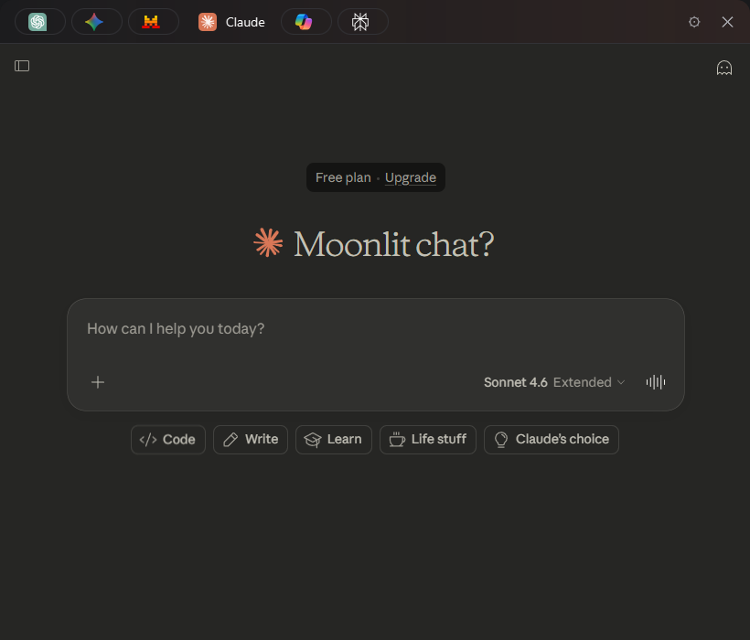
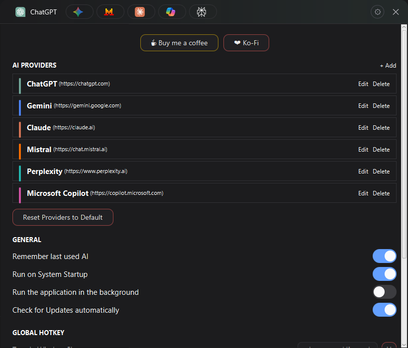

# Loom

<p align="center">

</p>

A modern, lightweight desktop application that provides unified access to multiple AI chat services through a sleek, always-on-top interface.

## Support

If this project helps you, consider supporting it:
- [Buy Me a Coffee](https://buymeacoffee.com/oldvalencia)
- [Ko-Fi](https://ko-fi.com/oldvalencia)

Also
- Issues: [GitHub Issues](https://github.com/OldValencia/ai-panel/issues)
- Discussions: [GitHub Discussions](https://github.com/OldValencia/ai-panel/discussions)

## Features

### 🎯 Multi-AI Support
- **ChatGPT** - OpenAI's conversational AI
- **Google Gemini** - Google's multimodal AI
- **Claude** - Anthropic's helpful AI assistant
- **Mistral** - Mistral AI's open models
- **Perplexity** - AI-powered search and answers
- **Microsoft Copilot** - Microsoft's AI companion

### 🎨 Modern Interface
- **Animated Dock** - macOS-style icon dock with smooth transitions
- **Custom Top Bar** - Integrated window controls with gradient effects
- **Drag & Drop Reordering** - Organize AI services to your preference (order persists across restarts)
- **Always On Top** - Quick access without switching windows
- **Rounded Corners** - Clean, modern aesthetic
- **Dim Overlay** - Elegant dimming effect when settings panel is open

### ⚡ Performance
- **Lightweight** - ~40-70MB RAM usage (optimized JVM settings)
- **Fast Startup** - Efficient initialization and resource management
- **Smooth Animations** - Hardware-accelerated rendering
- **Minimal Disk Usage** - Smart cache management

### 🛠️ Advanced Features
- **Zoom Control** - Per-AI zoom settings persist across sessions
- **Session Persistence** - Remembers last visited AI, zoom level, and icon order
- **Settings Panel** - Easy configuration with animated toggles
- **Clean UI** - No clutter, context menus disabled

### 🔧 Technical Highlights
- **JCEF Integration** - Full Chromium browser engine
- **Java 21** - Modern Java with optimized runtime
- **Native Look** - Platform-specific optimizations
- **Smart Cleanup** - Automatic cache and locale management
- **Settings Persistence** - All preferences saved to `~/.loom/settings.properties`

## Screenshots

### Application interface

### Application settings


## Installation

### Windows
1. Download `Loom-N.N.N.exe` from [Releases](https://github.com/OldValencia/ai-panel/releases)
2. Run the installer
3. Launch from Start Menu or Desktop shortcut

### macOS
1. Download `Loom-N.N.N.dmg` from [Releases](https://github.com/OldValencia/ai-panel/releases)
2. Open the DMG file
3. Drag **Loom** to Applications folder
4. Launch from Applications

### Linux
*Coming soon - use source build for now*

## Building from Source

### Prerequisites
- JDK 21 or higher
- Gradle 8.x (or use included wrapper)
- Git

### Build Steps
```bash
# Clone repository
git clone https://github.com/yourusername/ai-panel.git
cd ai-panel

# Build and run
./gradlew run

# Create optimized runtime
./gradlew jlink

# Package for your platform
./gradlew packageAll
```

## Configuration

### Settings Panel
Access via the gear icon (⚙) in the top-right corner:

**General**
- **Remember last AI** - Automatically open your most recent AI on startup

**Browser**
- **Zoom enabled** - Enable/disable zoom controls (zoom level persists when enabled)
- **Clear cookies** - Remove all stored cookies and session data

**Note**: All settings are automatically saved to `~/.loom/settings.properties` and persist across application restarts.

### Persistent Settings
The application remembers:
- ✅ Last visited AI service
- ✅ Zoom level (when zoom is enabled)
- ✅ AI icon order in the dock
- ✅ All settings panel preferences

### Configuration Files
- **Location**: `~/.loom/`
- **Settings**: `settings.properties` (all preferences stored here)
- **Logs**: `logs/app-YYYY-MM-DD_HH-mm-ss.log`
- **Cache**: `cache/` (managed automatically)

### Custom AI Services
Edit `src/main/resources/ai-configurations.yml`:

```yaml
configurations:
  - name: "Your AI"
    url: "https://your-ai-service.com"
    icon: "your-icon.svg"
    color: "#FF5733"
```

Place icon files in `src/main/resources/icons/`.

## Usage Tips

### Reordering AI Services
1. Hover over any AI icon in the dock
2. Click and drag to reorder
3. Release to set new position
4. **Order automatically saves** and persists across restarts

### Zoom Persistence
When zoom is enabled in settings:
- Your zoom level is **automatically saved** for each AI service
- Zoom level **persists across restarts**
- Disable zoom in settings to reset all zoom levels to 100%

### Window Management
- **Minimize**: Click the "−" button
- **Settings**: Click the "⚙" button (notice the dim overlay effect)
- **Close**: Click the "✕" button
- **Move**: Click and drag the top bar

### Visual Effects
- **Gradient Top Bar**: Color adapts to the currently selected AI service

## Packaging Guide

### Memory Optimization

The application is optimized for minimal memory footprint:

**JVM Flags** (in `build.gradle`):
```gradle
applicationDefaultJvmArgs = [
    '-Xms16m',                    // Initial heap
    '-Xmx48m',                    // Maximum heap
    '-Xss192k',                   // Thread stack size
    '-XX:MaxMetaspaceSize=24m',   // Metaspace limit
    '-XX:+UseSerialGC',           // Low-memory GC
    '-XX:MinHeapFreeRatio=10',    // Aggressive shrinking
    '-XX:MaxHeapFreeRatio=20'
]
```

**Expected Usage**:
- Baseline: ~80-120MB
- Optimized: ~40-70MB
- Runtime size: ~80-100MB (with bundled JRE)

### Creating Installers

#### Windows (.exe Installer)

**Using jpackage** (Recommended):
```bash
./gradlew packageWindows
```

Output: `build/packages/Loom-N.N.N.exe`

**Features**:
- Bundled JRE (no Java required)
- Start menu integration
- Desktop shortcut
- Add/Remove Programs entry
- Directory chooser

**Manual jpackage**:
```bash
jpackage \
  --type exe \
  --name "Loom" \
  --app-version N.N.N \
  --runtime-image build/image \
  --input build/libs \
  --main-jar loom-N.N.N.jar \
  --main-class io.loom.app.LoomApplication \
  --icon src/main/resources/icon.ico \
  --win-dir-chooser \
  --win-menu \
  --win-shortcut
```

#### macOS (.app + DMG)

**Using jpackage**:
```bash
./gradlew packageMac
```

Output: `build/packages/Loom-N.N.N.dmg`

**Features**:
- Native .app bundle
- Bundled JRE
- Drag-to-Applications installer
- macOS native look

### Quick Start
```bash
# Build for current platform
./gradlew clean build createInstaller

# Output
# Windows: build/packages/Loom-N.N.N.exe
# macOS: build/packages/Loom-N.N.N.dmg
```

### Icon Requirements

**Windows** (`.ico`):
- Sizes: 16x16, 32x32, 48x48, 256x256
- Tool: ImageMagick
```bash
convert icon.png -define icon:auto-resize=256,48,32,16 icon.ico
```

**macOS** (`.icns`):
- Sizes: 16@2x, 32@2x, 128@2x, 256@2x, 512@2x
- Tool: iconutil
```bash
mkdir icon.iconset
sips -z 16 16 icon.png --out icon.iconset/icon_16x16.png
sips -z 32 32 icon.png --out icon.iconset/icon_16x16@2x.png
# ... (repeat for all sizes)
iconutil -c icns icon.iconset
```

## Tech Stack

- **Java 21** - Modern Java with Virtual Threads support
- **JCEF (Chromium)** - Full-featured web browser engine
- **Swing** - Native desktop UI framework
- **FlatLaf** - SVG Icons support
- **Lombok** - Boilerplate reduction
- **Logback** - Structured logging
- **SnakeYAML** - Configuration management
- **Gradle** - Build automation

## Project Structure

```
loom/
├── src/main/
│   ├── java/io/loom/app/
│   │   ├── config/           # Configuration management
│   │   ├── ui/               # UI components
│   │   │   ├── dialogs/     # Dialog windows
│   │   │   ├── settings/    # Settings panel
│   │   │   └── topbar/      # Top bar components
│   │   ├── utils/           # Utilities
│   │   └── windows/         # Main windows
│   └── resources/
│       ├── ai-configurations.yml
│       ├── icons/           # AI service icons
│       └── logback.xml
├── build.gradle
└── README.md
```

## Performance Tuning

### JVM Options
See `build.gradle` for optimized JVM settings. Key optimizations:
- Serial GC for predictable memory usage
- Tiered compilation for faster startup
- Minimal heap allocation

### Cache Management
The application automatically cleans:
- Chromium cache directories
- Unused locale files (keeps only en-US)
- Old log files (keeps last 3)
- CEF log rotation at 2MB

### Settings Persistence
All preferences are efficiently stored in a single `settings.properties` file

## Troubleshooting

### Application won't start
- Ensure Java 21+ is installed
- Check logs in `~/.loom/logs/`
- Try: `./gradlew clean run`

### High memory usage
- Verify JVM flags in launcher
- Clear cookies and cache via Settings

### Window not appearing
- Check if already running (one instance only)
- Try resetting: Delete `~/.loom/settings.properties`
- Restart system

### Settings not persisting
- Check file permissions on `~/.loom/settings.properties`
- Ensure application has write access to `~/.loom/` directory
- Check logs for any persistence errors

### Zoom level resets
- Verify "Zoom enabled" is ON in Settings
- Zoom level only persists when zoom is enabled
- Check `last_zoom_value` in settings.properties
