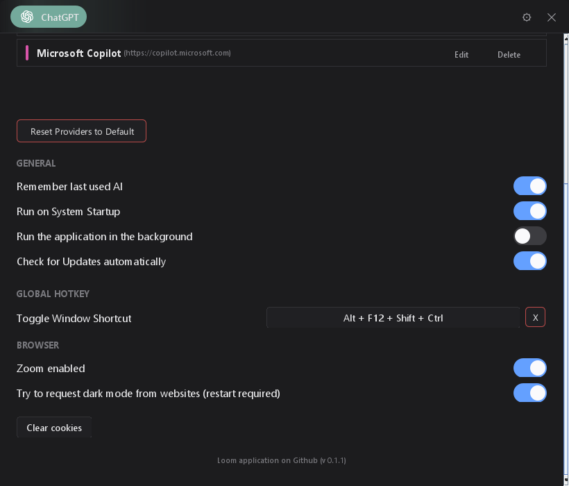

# Spark

<p align="center">

</p>

A modern, lightweight desktop application that provides unified access to multiple AI chat services through a sleek, always-on-top interface.

## Support

If this project helps you, consider supporting it:
- [Buy Me a Coffee](https://buymeacoffee.com/oldvalencia)
- [Ko-Fi](https://ko-fi.com/oldvalencia)

## Features

### 🎯 Multi-AI Support
Access your favorite AI services in one place. Pre-configured with:
- **ChatGPT**, **Google Gemini**, **Claude**, **Mistral**, **Perplexity**, **Microsoft Copilot**

### ✨ Key Features
- **Custom Providers Support** — Add any web-based AI service directly via Settings.
- **Global Hotkey** — Toggle the application visibility instantly (configurable).
- **Auto-Start** — Option to launch Spark automatically on system startup.
- **Always On Top** — Keep your AI assistant visible while working in other apps.
- **Session Persistence** — Remembers your last visited AI, zoom level, and window position.
- **Privacy Focused** — Easy "Clear Cookies" button to reset sessions.

### 🎨 Modern Interface
- **Animated Dock** — macOS-style icon dock with smooth transitions.
- **Drag & Drop Reordering** — Organize AI services to your preference.
- **Clean UI** — Minimalist design with a focus on content.

### ⚡ Performance
- **Lightweight** — Optimized JVM settings (~150-400MB RAM).
- **JCEF Integration** — Powered by a full Chromium browser engine for compatibility.

## Screenshots

### Application Interface


### Settings & Provider Management


### Settings & Hotkeys


## Installation

### Windows
1. Download `Spark-Windows-Installer.exe` from [Releases](https://github.com/OldValencia/ai-panel/releases).
2. Run the installer.

### macOS & Linux
*(Planned for future releases, but not currently supported)*

## Configuration

Access the **Settings Panel** via the gear icon (⚙) in the top-right corner.

### Managing AI Services
You no longer need to edit configuration files manually.
1. Go to **Settings** -> **Providers**.
2. Click **Add Provider**.
3. Enter the Name, URL, and choose an icon/color.
4. You can also disable or delete default providers.

### Global Hotkey
- Use this to quickly show/hide the application.

### Data Location
Application data is stored in your user directory:
- **Windows**: `C:\Users\<User>\Documents\OldValencia\Spark\`
- **macOS/Linux**: `~/Library/Application Support/OldValencia/Spark/` *(Planned)*

Contains:
- `app-config.json` — General preferences.
- `custom-providers.json` — Your custom AI configurations.
- `logs/` — Application logs.

## Building from Source

### Prerequisites
- JDK 21
- Gradle 8.x (wrapper included)

### Build Steps
```bash
# Clone repository
git clone https://github.com/OldValencia/spark.git
cd spark

# Run locally
./gradlew run

# Build installers
./gradlew clean build createInstaller
